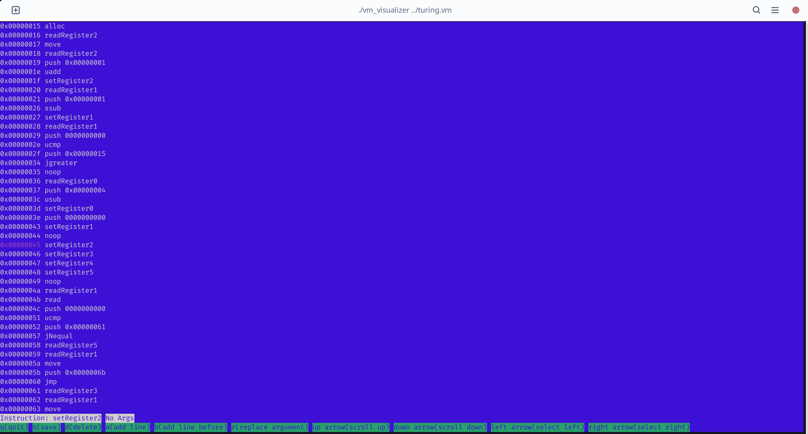

# VirtualMachine 2 Visualizer
This project is a ncurses-based terminal editor for the bytecode of my VirtualMachine2. It allows the user to insert and delete instructions and browse vm2 bytecode. The virtual machine to execute this vm2 bytecode is defined in the [VirtualMachine2](https://github.com/batburger/VirtualMachine2) repository. There is an easier way to generate the bytecode for vm2 by using the "compiler" I wrote [VirtualMachine2-Compiler](https://github.com/batburger/VirtualMachine2-Compiler). That repository also includes the "specifications" for this virtual machine, which are incomplete and refer to features that aren't implemented. Nevertheless, it would be wrong to trim these loose ends. (This was created in 2018 / This is a hobby High School project)

## Screenshots

## Dependencies
* C11 Standard
* NCurses (depending on your distribution some of the includes may change)

## Building
Run `cmake .` and then `cmake --build .`
